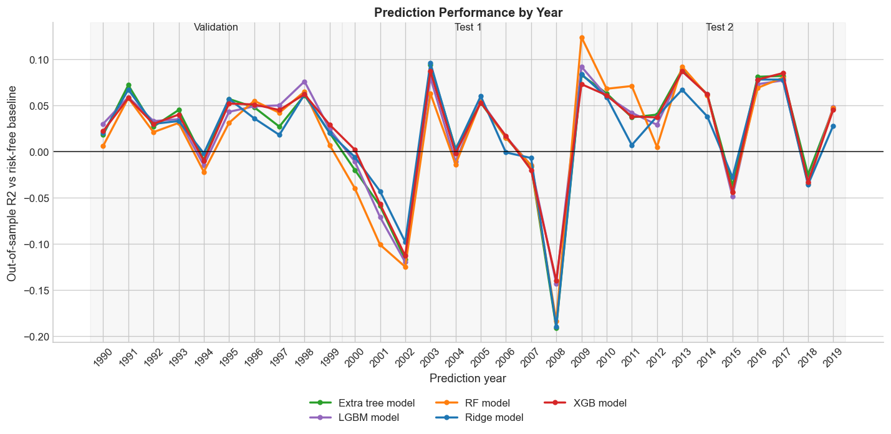

# Empirical Equity Return Prediction

This project investigates whether simple firm-level price features and market-state variables contain predictive information for next-month equity returns.

It is designed as a portfolio-style quantitative research project using machine learning. The focus is on building a reproducible research pipeline, applying walk-forward out-of-sample validation, and comparing linear, tree-based, and boosting models across different market regimes.

The current `main` branch contains a complete runnable version of the project. The project is still being developed and improved.

This project is inspired by Gu, Kelly, and Xiu’s Empirical Asset Pricing via Machine Learning, which studies how machine learning methods can be used to predict the cross-section of equity returns.
## Project Overview

The pipeline uses historical equity prices from Yahoo Finance to build monthly cross-sectional prediction datasets. For each stock-month observation, the model uses lagged return, volatility, and market beta features to predict the following month's return.

Current modelling approaches include:

- Ridge regressor
- Random forest regressor
- Extra tree regressor
- XGBoost regressor
- LightGBM regressor

The evaluation is currently based on out-of-sample metrics comparing the result to the risk-free rate using an R-squared-style metric. The model is trained on a rolling 20-year window, predicts the following year, and is refit annually. I split the evaluation period into three regimes:

- 1990-1999: validation period used for model and parameter selection
- 2000-2009: first test period, covering the dot-com crash and global financial crisis
- 2010-2019: second test period, covering the post-crisis decade

| Period | Extra tree model | LGBM model | RF model | Ridge model | XGB model |
|--------| ---: | ---: | ---: | ---: | ---: |
| 1990-1999 | 0.037 | 0.038 | 0.029 | 0.034 | 0.038 |
| 2000-2009 | -0.015 | -0.013 | -0.022 | -0.01 | -0.01 |
| 2010-2019 | 0.044 | 0.04 | 0.041 | 0.033 | 0.042 |




## How to run 
The project can be run by the following terminal commands:
- pip install -r requirements.txt
- python scripts/S1_download_data.py
- python scripts/S2_process_data.py
- python scripts/run_model.py


## Limitations

- The current universe is manually selected and therefore subject to survivorship bias. Yahoo Finance data can also include revisions and ticker-history complications.
- The current evaluation focuses on predictive error rather than full tradability. The results should not be interpreted as evidence of a deployable trading strategy until portfolio construction, transaction costs, turnover, and risk controls are added.


## Repository Structure

```text
.
+-- README.md                         # Project overview, methodology, limitations, and headline results
+-- .gitignore                        # Excludes environments, caches, notebooks, and generated data
+-- data/
|   +-- raw/                          # Local downloaded Yahoo Finance data, ignored by Git to reduce filesize
|   +-- processed/                    # Local generated feature panel, ignored by Git to reduce filesize
|   +-- results/                      # Results
+-- scripts/
|   +-- S1_download_data.py            # Download raw equity, benchmark, volume, and risk-free-rate data
|   +-- S2_process_data.py             # Build the processed monthly feature panel
|   +-- S3_model_validation.ipynb      # Local notebook for model/parameter validation
|   +-- run_model.py                   # Run rolling-window model evaluation and save CSV results
+-- src/
    +-- data_loader.py                 # Data download and persistence helpers
    +-- features.py                    # Feature engineering and rolling train/test splits
    +-- Models.py                      # Candidate model definitions
    +-- evaluate_prediction.py         # Error and R-squared-style evaluation metrics
```

## Methodology

The project uses a walk-forward cross-sectional prediction setup rather than a random train/test split.

1. Download adjusted close prices for the stock universe, S&P 500 as the benchmark and Treasury bill yield as the risk-free-rate proxy from Yahoo Finance.
2. Convert daily prices to month-end observations and build one stock-month row per asset with only information available at that month-end.
3. Train and compare models with different parameters on a rolling 20-year history on the validation time 1990-1999.
4. Predict the following out-of-sample year for models with the best performing parameters.
5. Refit annually and aggregate results by regime.

The current stock-level features are:

- One-month, three-month, six-month, and twelve-month trailing stock returns
- One-month, three-month, six-month, and twelve-month trailing daily-return volatility
- Rolling one-year beta estimated against S&P 500 daily returns
- Beta-scaled benchmark return
- Beta-scaled benchmark volatility

The prediction target is the next-month stock return. The evaluation compares model forecast errors against a risk-free-rate baseline using an out-of-sample R-squared-style metric:

```text
R2_oos = 1 - sum((prediction - realized_return)^2) / sum((realized_return - risk_free_rate)^2)
```

The experiment is split into three regimes:

- Validation: 1990-1999, used for model and parameter selection
- Test 1: 2000-2009, covering the dot-com crash and global financial crisis
- Test 2: 2010-2019, covering the post-crisis decade

This design is meant to test whether the feature set contains persistent predictive information across distinct market environments.

## Summary 


## Reference
Gu, Shihao, Bryan Kelly, and Dacheng Xiu. "Empirical asset pricing via machine learning." The Review of Financial Studies 33.5 (2020): 2223-2273.