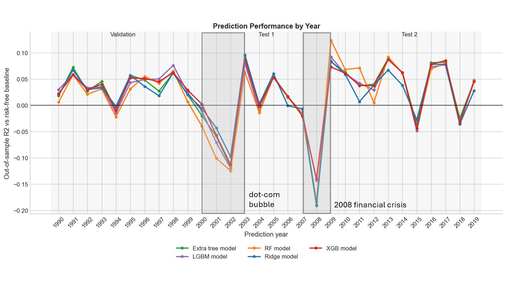
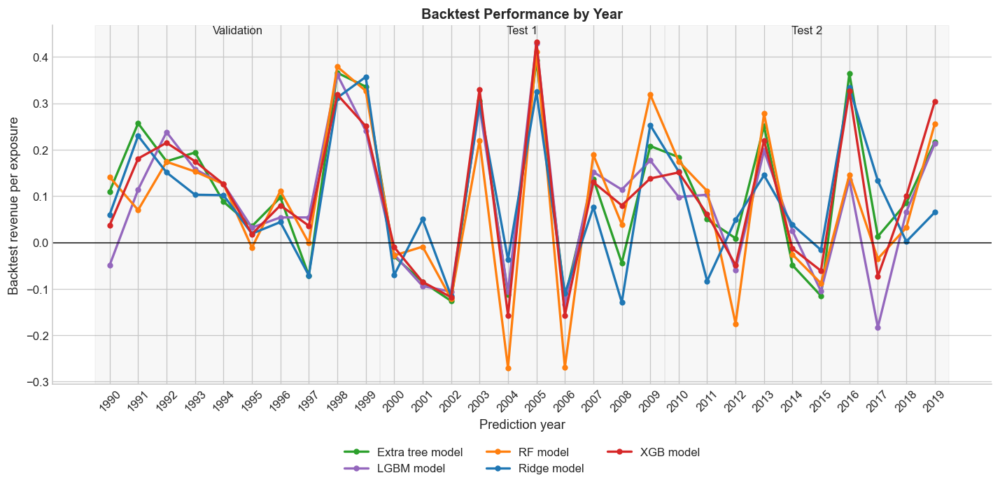

# Empirical Equity Return Prediction

This project studies whether simple firm-level price signals can predict next-month equity returns in the cross-section of U.S. stocks.

Using historical Yahoo Finance data, I build a monthly stock-level dataset with lagged returns, volatility, and market beta features. I compare linear, tree-based, and boosting models using walk-forward out-of-sample validation, then test whether the forecasts translate into a monthly rebalanced long-short portfolio.

The project is inspired by Gu, Kelly, and Xiu's "Empirical Asset Pricing via Machine Learning" and is intended as a reproducible quantitative research workflow rather than a production trading strategy.

## Key Findings

- Simple lagged return, volatility, and beta-based features show modest out-of-sample predictive power.
- Prediction performance is regime-dependent: models perform well in the 1990s and 2010s but struggle during 2000-2009.
- The long-short backtest produces positive annualized returns in all three periods before transaction costs.
- The prediction shows good performance in identifying winning and losing assets.
- Results should be interpreted as a research prototype because the stock universe is manually selected and subject to survivorship bias.

## Project Overview

The prediction pipeline uses historical equity prices from Yahoo Finance to build monthly cross-sectional prediction datasets. For each stock-month observation, the model uses lagged return, volatility, and market beta features to predict the following month's return.

Current modeling approaches include:

- Ridge regressor
- Random forest regressor
- Extra Trees regressor
- XGBoost regressor
- LightGBM regressor

Each model is trained on a rolling 20-year window, predicts the following year, and is refit annually. The evaluation period is split into three regimes:

- 1990-1999: validation period used for model and parameter selection
- 2000-2009: first test period, covering the dot-com crash and global financial crisis
- 2010-2019: second test period, covering the post-crisis decade

## Prediction Results

For each period, the table reports out-of-sample predictive performance using an R-squared-style metric against a risk-free-rate baseline. A positive value means the model improves on the risk-free-rate benchmark; a negative value means it performs worse than that benchmark.

| Period   | Ridge model | RF model | Extra Trees model | XGB model | LGBM model |
|----------| ---: | ---: | ---: | ---: | ---: |
| 1990-1999 | 0.034 | 0.029 | 0.037 | 0.038 | 0.037 |
| 2000-2009 | -0.010 | -0.023 | -0.016 | -0.009 | -0.012 |
| 2010-2019 | 0.033 | 0.042 | 0.044 | 0.041 | 0.039 |

The performance of the prediction is shown in the following figure:



The strongest results occur in the 1990s validation period and the 2010s test period. All models struggled during 2000-2009, particularly around the dot-com crash and global financial crisis, which suggests that the signal has strong market dependence.

## Backtest Results

The backtest uses model predictions to form a monthly rebalanced long-short portfolio. Stocks with positive relative predicted returns are held long, and stocks with negative relative predicted returns are held short. The table reports annualized compounded long-short returns by decade before transaction costs.

| Period   | Ridge model | RF model | Extra Trees model | XGB model | LGBM model |
|----------| ---: | ---: | ---: | ---: | ---: |
| 1990-1999 | 0.128 | 0.138 | 0.160 | 0.150 | 0.129 |
| 2000-2009 | 0.041 | 0.018 | 0.038 | 0.046 | 0.055 |
| 2010-2019 | 0.081 | 0.052 | 0.095 | 0.081 | 0.038 |

The performance of the backtest is shown in the following figure:



## Methodology

The project uses a walk-forward cross-sectional prediction design rather than a random train/test split. At each annual step, the models are trained on the previous 20 years of monthly stock observations and then used to predict the next 12 out-of-sample monthly cross-sections. The models are refit once per year, so the evaluation mimics a researcher updating a model through time using only past data.

The raw data consists of adjusted close prices for the selected stock universe, S&P 500 prices as the market benchmark, and a Treasury bill yield proxy for the risk-free rate. Daily prices are converted into month-end observations, and each row in the processed dataset represents one stock at one month-end.

The feature set is intentionally simple and price-based:

- Trailing stock returns over 1, 3, 6, and 12 months
- Trailing daily-return volatility over 1, 3, 6, and 12 months
- Rolling one-year beta estimated against S&P 500 daily returns
- Beta-scaled benchmark return and benchmark volatility

The prediction target is the following month's stock return. Hyperparameters are selected using the 1990-1999 validation period, and the chosen model configurations are then evaluated on the 2000-2009 and 2010-2019 test periods. Predictive performance is measured using an out-of-sample R-squared-style metric against a risk-free-rate baseline:

```text
R2_oos = 1 - sum((prediction - realized_return)^2) / sum((realized_return - risk_free_rate)^2)
```

The backtest translates the monthly predictions into a long-short portfolio. Within each month, stocks are ranked by their model forecast relative to the cross-sectional average forecast. Positive relative forecasts are assigned to the long side, negative relative forecasts to the short side, and the portfolio is rebalanced monthly. This creates a simple test of whether the prediction signal has economic value, not only statistical predictive value.

## How to Run

The project can be run with the following terminal commands:

```bash
pip install -r requirements.txt
python scripts/S1_download_data.py
python scripts/S2_process_data.py
python scripts/run_model.py
```

The scripts download data from Yahoo Finance, build the processed monthly feature panel, and write result tables to `data/results/`. Because the data source is live, rerunning the pipeline may produce small changes if Yahoo Finance revises or adjusts historical data.

## Limitations

- The stock universe is manually selected and therefore subject to survivorship bias. It overrepresents firms with long available histories and does not properly include delisted, bankrupt, acquired, or renamed firms.
- Yahoo Finance data is accessible for me, but not institutional-grade. Adjusted prices, corporate actions, missing histories, and ticker changes can be revised or handled inconsistently.
- The risk-free-rate proxy is an approximation and may not perfectly match the timing, maturity, or investability assumptions used in a real portfolio.
- The backtest is idealized. It excludes transaction costs, bid-ask spreads, slippage, financing costs, short-borrow costs, taxes, liquidity constraints, and position-size limits.
- The model comparison is based on a limited set of fixed hyperparameter choices after validation. A broader search could improve performance, but would also increase the risk of overfitting and would require more computational power.
- The results should be interpreted as evidence from a research prototype, not as evidence of a deployable trading strategy.

## Next steps and further improvement
- Add transaction costs, turnover, leverage, drawdown, and Sharpe ratio analysis.
- Compare against equal-weight, market-cap-weight, S&P 500, and simple momentum baselines.
- Add unit tests for feature construction, train/test splits, evaluation metrics, and portfolio weights.
- Expand the feature set with accounting variables, liquidity measures, valuation ratios, and sector controls.

## Summary

This project finds that simple price-based firm characteristics contain some information about next-month equity returns, but the signal is unstable across market regimes. The models produce positive out-of-sample predictive performance in the 1990s and 2010s, while performance deteriorates during the 2000-2009 period that includes the dot-com crash and global financial crisis.

The backtest suggests that the prediction signal can translate into positive long-short portfolio returns before costs, but the result should be treated cautiously because the portfolio is idealized and the stock universe is survivorship-biased. The main value of the project is therefore not a claim of a production-ready strategy, but a reproducible empirical asset-pricing workflow: data collection, feature construction, walk-forward validation, model comparison, and regime-based evaluation.

## Repository Structure

```text
.
+-- README.md                         # Project description, methodology, results, and limitations
+-- requirements.txt                  # Python package dependencies
+-- .gitignore                        # Excludes environments, caches, and generated local data
+-- data/
|   +-- raw/                          # Downloaded Yahoo Finance data, generated locally
|   +-- processed/                    # Processed monthly feature panel, generated locally
|   +-- results/                      # Committed result tables and figures
+-- scripts/
|   +-- S1_download_data.py           # Download equity, benchmark, volume, and risk-free-rate data
|   +-- S2_process_data.py            # Build the processed monthly feature panel
|   +-- S3_model_validation.ipynb     # Notebook used for model and parameter validation
|   +-- run_model.py                  # Run walk-forward prediction and backtest evaluation
+-- src/
    +-- data_loader.py                # Data download and persistence helpers
    +-- features.py                   # Feature engineering and walk-forward train/test splits
    +-- Models.py                     # Candidate model definitions
    +-- evaluate_prediction.py        # Error and out-of-sample R-squared metrics
    +-- portfolio.py                  # Long-short portfolio construction helpers
```

## Reference

Gu, Shihao, Bryan Kelly, and Dacheng Xiu. "Empirical asset pricing via machine learning." The Review of Financial Studies 33.5 (2020): 2223-2273.
